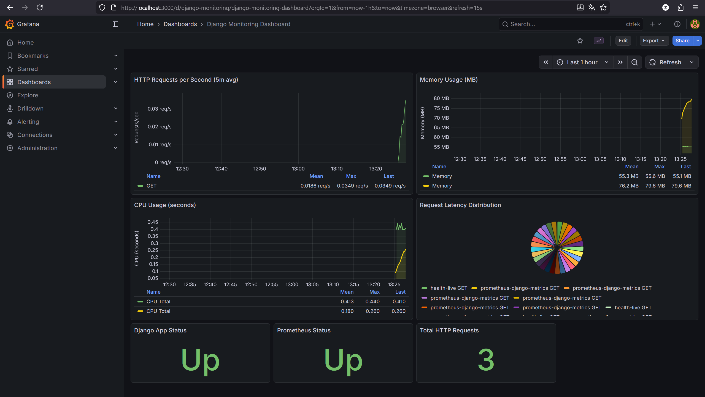
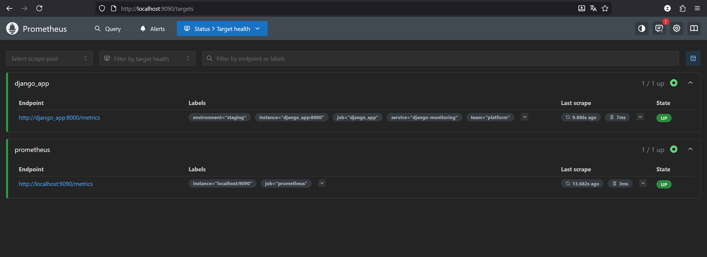

# ️ dashboard-django-prometheus-grafana-docker

    

Solución profesional de observabilidad para APIs Django en contenedores Docker. Incluye métricas de aplicación, scraping con Prometheus y visualización en Grafana con dashboard provisionado automáticamente.

##  Tabla de Contenidos
- [Descripción General](#-descripción-general)
- [Arquitectura del Sistema](#-arquitectura-del-sistema)
- [Características](#-características)
- [Estructura del Proyecto](#-estructura-del-proyecto)
- [Requisitos Previos](#-requisitos-previos)
- [Inicio Rápido](#-inicio-rápido)
- [Cómo Funciona](#-cómo-funciona)
- [Generar Data de Ejemplo](#-generar-data-de-ejemplo)
- [Validaciones de Monitoreo](#-validaciones-de-monitoreo)
- [Resolución de Problemas](#-resolución-de-problemas)
- [Buenas Prácticas de Producción](#-buenas-prácticas-de-producción)
- [Contacto y Autor](#-contacto-y-autor)
- [Licencia](#-licencia)

##  Descripción General
`dashboard-django-prometheus-grafana-docker` implementa un stack completo de monitoreo:
- API Django con métricas Prometheus (`/metrics`).
- Prometheus scrapeando la app cada 15s.
- Grafana con datasource y dashboard provisionados.
- PostgreSQL como base de datos de la app.
- Docker Compose para levantar todo en un solo comando.

## ️ Arquitectura del Sistema
```text
┌──────────────────────────────────────────────────────────────────┐
│          dashboard-django-prometheus-grafana-docker             │
└──────────────────────────────────────────────────────────────────┘

Host (Windows/Linux)
   │
   ├── http://localhost:8000   -> Django API + /metrics
   ├── http://localhost:9090   -> Prometheus
   └── http://localhost:3000   -> Grafana
   │
   ▼
┌──────────────────────────────────────────────────────────────────┐
│ Docker Network: monitoring                                      │
│                                                                  │
│  django_app:8000  --->  prometheus:9090  --->  grafana:3000     │
│       │                       │                  (dashboards)     │
│       └------ postgres_db:5432┘                                  │
└──────────────────────────────────────────────────────────────────┘
```

## ✨ Características
- ✅ Métricas automáticas de Django con `django-prometheus`.
- ✅ Métricas personalizadas de API (requests, duración, errores, memoria, CPU).
- ✅ Dashboard de Grafana precargado.
- ✅ Datasource Prometheus provisionado por archivo.
- ✅ Healthchecks en todos los servicios del stack.
- ✅ Persistencia con volúmenes Docker.
- ✅ Listo para CI/CD y despliegues repetibles.

##  Estructura del Proyecto
```text
Docker/
├── api/
├── config/
├── grafana/
│   ├── dashboards/
│   │   └── django-monitoring.json
│   └── provisioning/
│       ├── dashboards/
│       │   └── dashboards.yml
│       └── datasources/
│           └── prometheus.yml
├── postgres/
│   └── init.sql
├── prometheus/
│   └── prometheus.yml
├── docker-compose.yml
├── Dockerfile
├── requirements.txt
├── README.md
├── grafana.png
└── prometheus.png
```

##  Requisitos Previos
- Docker Desktop / Docker Engine
- Docker Compose v2

Verificación:
```bash
docker --version
docker compose version
```

##  Inicio Rápido
### 1) Construir y levantar stack
```bash
docker compose up -d --build
```

### 2) Validar estado de contenedores
```bash
docker compose ps
```

Debes ver `healthy` en:
- `monitoring_postgres`
- `monitoring_django`
- `monitoring_prometheus`
- `monitoring_grafana`

### 3) Accesos
- API Django: http://localhost:8000
- Metrics endpoint: http://localhost:8000/metrics
- Prometheus: http://localhost:9090
- Grafana: http://localhost:3000

Credenciales por defecto de Grafana:
- Usuario: `admin`
- Password: `grafana_secure_pass_456`

## ⚙️ Cómo Funciona
1. Django expone métricas en `/metrics`.
2. Prometheus scrapea la app con `job: django_app` cada 15s.
3. Grafana usa datasource `Prometheus` (uid `prometheus`).
4. El dashboard `Django Monitoring Dashboard` consulta PromQL en tiempo real.
5. El sistema se mantiene con healthchecks y reinicio automático.

##  Generar Data de Ejemplo
### PowerShell (Windows)
```powershell
Invoke-WebRequest -UseBasicParsing http://localhost:8000/api/health/live/ | Out-Null
Invoke-WebRequest -UseBasicParsing http://localhost:8000/api/health/status/ | Out-Null

1..30 | ForEach-Object {
  Invoke-WebRequest -UseBasicParsing -Method Post -Uri http://localhost:8000/api/metrics-info/simulate_load/ `
    -ContentType "application/json" `
    -Body '{"iterations":10}' | Out-Null
  Start-Sleep -Milliseconds 300
}
```

### curl (Linux/macOS)
```bash
curl http://localhost:8000/api/health/live/
curl http://localhost:8000/api/health/status/

for i in {1..30}; do
  curl -X POST http://localhost:8000/api/metrics-info/simulate_load/ \
    -H "Content-Type: application/json" \
    -d '{"iterations":10}'
  sleep 0.3
done
```

##  Validaciones de Monitoreo
### Prometheus Targets
- URL: http://localhost:9090/targets
- Esperado: `UP` en `django_app` y `prometheus`.

### PromQL de prueba
```promql
up
```
```promql
rate(django_http_requests_total_by_method_total[5m])
```
```promql
process_resident_memory_bytes / 1024 / 1024
```

### Dashboard Grafana
1. Entra a http://localhost:3000
2. Abre `Dashboards` -> `Django Monitoring Dashboard`
3. Selecciona rango `Last 15 minutes`

### Capturas reales




## ️ Resolución de Problemas
### Dashboard vacío
- Verifica datasource: Grafana -> Connections -> Data sources -> Prometheus.
- Verifica targets: http://localhost:9090/targets.
- Genera tráfico de ejemplo (sección anterior).

### Servicios no levantan
```bash
docker compose logs -f django_app
docker compose logs -f prometheus
docker compose logs -f grafana
docker compose logs -f postgres_db
```

### Reinicio completo
```bash
docker compose down
docker compose up -d --build
```

##  Buenas Prácticas de Producción
- Usar secretos reales para `DJANGO_SECRET_KEY`, `DB_PASSWORD`, `GRAFANA_ADMIN_PASSWORD`.
- Configurar `ALLOWED_HOSTS` y `CORS_ALLOWED_ORIGINS` con dominios reales.
- Publicar detrás de reverse proxy con TLS.
- Mantener backups de PostgreSQL y volúmenes.
- Versionar imágenes y usar tags estables.

##  Contacto y Autor
Desarrollador: **Isaac Esteban Haro Torres**

- Email: zackharo1@gmail.com
- WhatsApp: 098805517
- GitHub: https://github.com/ieharo1
- Portafolio: https://ieharo1.github.io/portafolio-isaac.haro/

© 2026 Isaac Esteban Haro Torres - Todos los derechos reservados.

##  Licencia
Este proyecto se proporciona tal cual para fines educativos y profesionales.

- Versión: `1.0.0`
- Estado: `✅ Listo para Producción`
